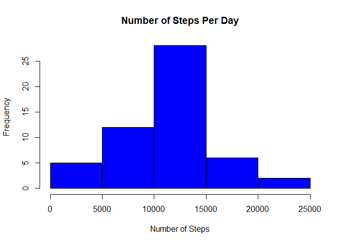
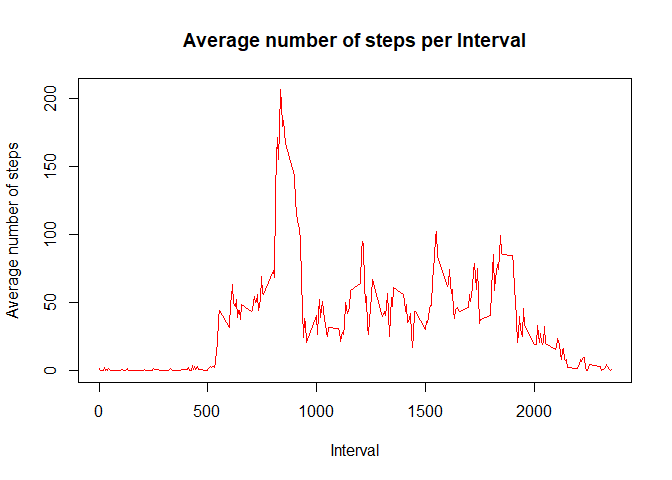
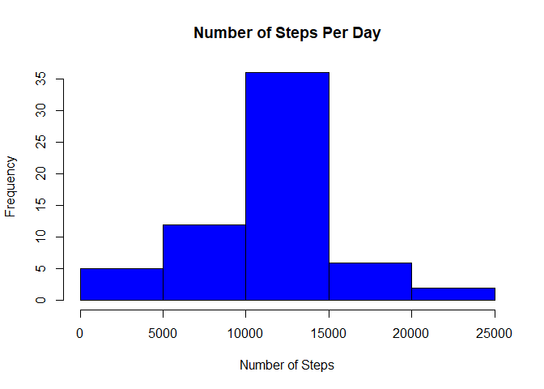
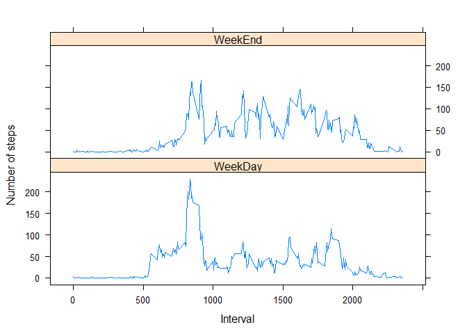

## Introduction

This is the report for the Reproducible Research Peer Graded Assignment 1. The details relating to the assignment are in [Readme.md](https://github.com/KrishniM/Course5-PeerGradedAssignment1/blob/master/README.md) file that has been included in the submitted github repository.

## Loading and preprocessing the data

**Dataset:** Activity monitoring data [52K]  

The variables included in this dataset are:
- **steps:** Number of steps taking in a 5-minute interval (missing values are coded as \color{red}{\verb|NA|}NA)
- **date:** The date on which the measurement was taken in YYYY-MM-DD format
- **interval:** Identifier for the 5-minute interval in which measurement was taken

The dataset is stored in a comma-separated-value (CSV) file and there are a total of 17,568 observations in this dataset.


### Sample Activity Data

```
##     steps       date interval     day
## 289     0 2012-10-02        0 Tuesday
## 290     0 2012-10-02        5 Tuesday
## 291     0 2012-10-02       10 Tuesday
## 292     0 2012-10-02       15 Tuesday
## 293     0 2012-10-02       20 Tuesday
## 294     0 2012-10-02       25 Tuesday
```


### What is mean total number of steps taken per day?

**1 - Make a histogram of the total number of steps taken each day**

```r
steps_per_day <- aggregate(steps ~ date, data = activity_nonulls, FUN = sum)
colnames(steps_per_day)<- c("Date" , "Steps")

hist(steps_per_day$Steps, main = "Number of Steps Per Day" , xlab = "Number of Steps", ylab = "Frequency" , col = "blue" ,breaks = 5)
```

<!-- -->

**2- Calculate and report the mean and median total number of steps taken per day**

### Mean number of steps  
The mean number of steps is calculated as 

```r
mean(steps_per_day$Steps)
```

**The average or mean number of steps taken each day was **

```
## [1] 10766.19
```

### Median number of steps
The median number of steps is calculated as 

```r
median(steps_per_day$Steps)
```

**The median number of steps taken was ** 

```
## [1] 10765
```


### What is the average daily activity pattern?

**1- Make a time series plot (i.e. type = "l") of the 5-minute interval (x-axis) and the average number of steps taken, averaged across all days (y-axis)**

```r
steps_per_interval <- aggregate(steps ~ interval, data = activity_nonulls, FUN = mean , na.rm = TRUE)

plot (x = steps_per_interval$interval , y = steps_per_interval$steps, type = "l" , 
      col = "red" ,
      main = "Average number of steps per Interval",
      xlab = 'Interval',
      ylab = 'Average number of steps')
```

<!-- -->

**2 - Which 5-minute interval, on average across all the days in the dataset, contains the maximum number of steps?**
Calculation :- 

```r
steps_per_interval$interval[which.max(steps_per_interval$steps)]
```

**Interval with the maximum steps was**

```
## [1] 835
```


### Imputing missing values

**1 - Calculate and report the total number of missing values in the dataset (i.e. the total number of rows with \color{red}{\verb|NA|}NAs)**

```r
missing_values <- activity[ is.na(activity$steps),]

numberofmissingvalues <- sum ( is.na(activity$steps))
numberofmissingvalues
```

```
## [1] 2304
```

**2 - Devise a strategy for filling in all of the missing values in the dataset. The strategy does not need to be sophisticated. For example, you could use the mean/median for that day, or the mean for that 5-minute interval, etc.**

```r
newdata<-merge(missing_values,steps_per_interval,by= c("interval"))
newdataFormat <- newdata[, c(5,3,1,4)]
colnames(newdataFormat) <-c("steps" ,"date" ,"interval" ,"day")
```

**3 - Create a new dataset that is equal to the original dataset but with the missing data filled in.**
The missing values will be set to average value for the interval

```r
mergedData <- rbind(activity_nonulls, newdataFormat)
```

** 4 - Make a histogram of the total number of steps taken each day and Calculate and report the mean and median total number of steps taken per day. Do these values differ from the estimates from the first part of the assignment? What is the impact of imputing missing data on the estimates of the total daily number of steps?**

```r
steps_per_day2 <- aggregate(steps ~ date, data = mergedData, FUN = sum)
colnames(steps_per_day2)<- c("Date" , "Steps")

hist(steps_per_day2$Steps, main = "Number of Steps Per Day" , xlab = "Number of Steps", ylab = "Frequency" , col = "blue" ,breaks = 5)
```

<!-- -->

```r
summary(mergedData)
```

```
##      steps             date               interval          day           
##  Min.   :  0.00   Min.   :2012-10-01   Min.   :   0.0   Length:17568      
##  1st Qu.:  0.00   1st Qu.:2012-10-16   1st Qu.: 588.8   Class :character  
##  Median :  0.00   Median :2012-10-31   Median :1177.5   Mode  :character  
##  Mean   : 37.38   Mean   :2012-10-31   Mean   :1177.5                     
##  3rd Qu.: 27.00   3rd Qu.:2012-11-15   3rd Qu.:1766.2                     
##  Max.   :806.00   Max.   :2012-11-30   Max.   :2355.0
```

```r
summary(steps_per_day2)
```

```
##       Date                Steps      
##  Min.   :2012-10-01   Min.   :   41  
##  1st Qu.:2012-10-16   1st Qu.: 9819  
##  Median :2012-10-31   Median :10766  
##  Mean   :2012-10-31   Mean   :10766  
##  3rd Qu.:2012-11-15   3rd Qu.:12811  
##  Max.   :2012-11-30   Max.   :21194
```

**Mean number of steps**  
The mean number of steps is calculated as 

```r
mean(steps_per_day2$Steps)
```

**The average or mean number of steps taken each day was **

```
## [1] 10766.19
```

**Median number of steps**
The median number of steps is calculated as 

```r
median(steps_per_day2$Steps)
```

**The median number of steps taken was ** 

```
## [1] 10766.19
```


### Are there differences in activity patterns between weekdays and weekends?

**1 - Create a new factor variable in the dataset with two levels - "weekday" and "weekend" indicating whether a given date is a weekday or weekend day.**

```r
mergedData$DayType<- ifelse(mergedData$day %in% c("Saturday" , "Sunday"), "WeekEnd" , "WeekDay")
```


**2 - Make a panel plot containing a time series plot (i.e. \color{red}{\verb|type = "l"|}type="l") of the 5-minute interval (x-axis) and the average number of steps taken, averaged across all weekday days or weekend days (y-axis). See the README file in the GitHub repository to see an example of what this plot should look like using simulated data.**

```r
steps_per_day_mean <- ddply(mergedData,.(interval,DayType),summarize, average = mean(steps))

head(steps_per_day_mean)
```

```
##   interval DayType    average
## 1        0 WeekDay 2.25115304
## 2        0 WeekEnd 0.21462264
## 3        5 WeekDay 0.44528302
## 4        5 WeekEnd 0.04245283
## 5       10 WeekDay 0.17316562
## 6       10 WeekEnd 0.01650943
```

```r
library(lattice)
xyplot(average~interval|DayType,data=steps_per_day_mean, type="l" , layout=c(1,2), ylab="Number of steps", xlab="Interval")
```

<!-- -->


```r
 file.rename(from="PA1_template.md",  to="README.md")
```

```
## [1] TRUE
```

